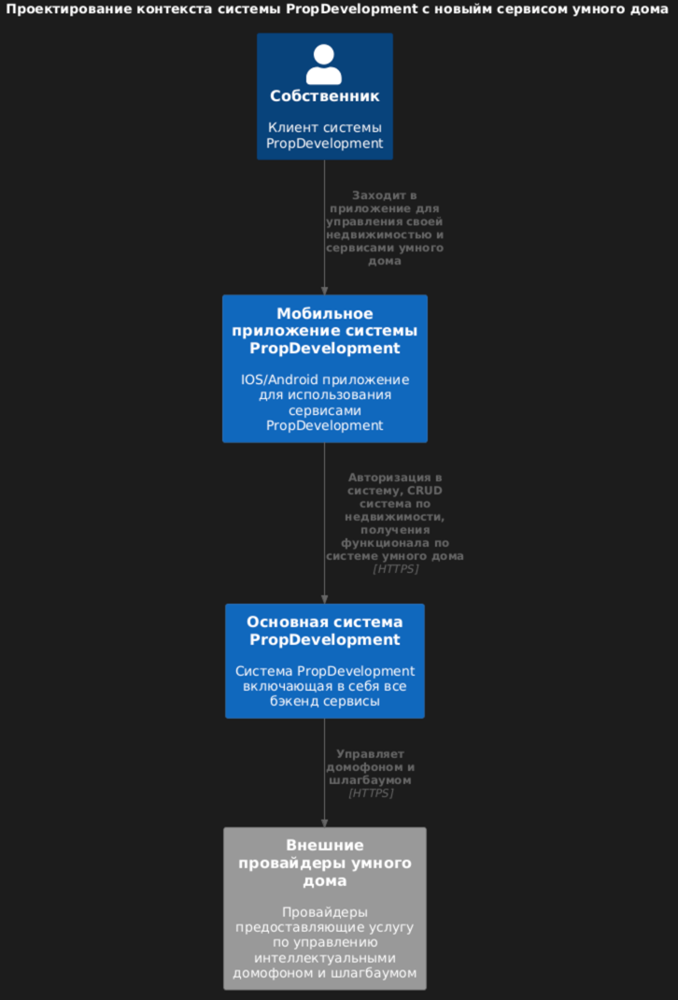
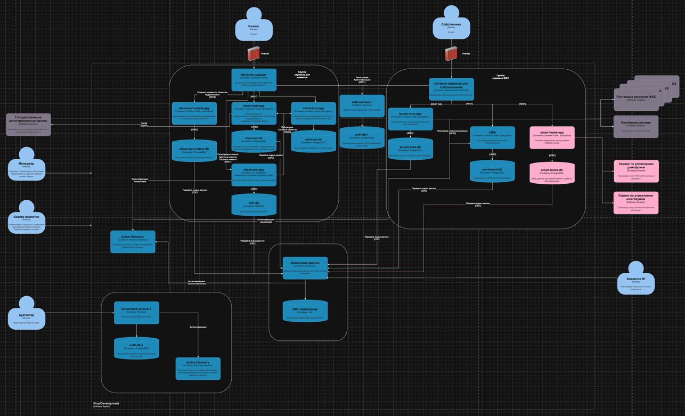

# Сдача проектной работы 7 спринта

## Задание 1. Разработка проверочного листа по безопасности данных
Визуализация результата анализа в виде [mindmap.drawio](Task1/mindmap.drawio)

## Задание 2. Разработка и заполнение проверочного листа для бизнес-систем
Заполненный проверочный лист: [IB.md](Task2/IB.md)

## Задание 3. Внешние интеграции
Схема диаграмм контейнеров PropDevelopment:
[PropDevelopmentDiagram.drawio](Task3/PropDevelopmentDiagram.drawio)

Диаграмма контекста в модели С4:
[ContextPropDevelopmentDiagram.puml](Task3/ContextPropDevelopmentDiagram.puml)


Обновленная схема диаграмм контейнеров PropDevelopment с добавлением новых сервисов интеллектуального домофона и шлагбаума: 
[UpdatePropDevelopmentDiagram.drawio](Task3/UpdatePropDevelopmentDiagram.drawio)


### Требования к безопасности
- Все данные, проходящие между системами PropDevelopment и внешней платформой, должны передаваться только по защищённым каналам, обязательное использование TLS 1.2 или выше.  
- Взаимодействие должно происходить через сегментированную сеть или DMZ для изоляции внешнего обмена от внутренних критичных систем.  
- Должны применяться меры по журналированию и аудиту запросов между системами, чтобы фиксировать все вызовы внешних сервисов и отслеживать подозрительную активность.  
- Доступ к внешним интеграциям должен быть ограничен только для разрешённых бизнес-сценариев (например, только мобильное приложение собственников может инициировать вызов внешних сервисов).  
- Партнёрская платформа должна соответствовать корпоративным требованиям по защите персональных данных и стандартам информационной безопасности (например, требованиям 152-ФЗ, ISO/IEC 27001).

### Протоколы аутентификации и авторизации
- Для аутентификации и авторизации при обмене данными рекомендуется использовать протокол OAuth 2.0 в сочетании с JSON Web Tokens (JWT). Эта технология позволит передавать информацию о правах пользователей и обеспечить контроль доступа к функциям внешних систем.  
- Взаимная TLS-автентификация (mutual TLS) может быть дополнительно применена для проверки подлинности серверов как со стороны PropDevelopment, так и со стороны внешнего партнёра.  
- Если внешняя платформа уже интегрирована с корпоративным Identity Provider (например, Active Directory через SAML или OpenID Connect), необходимо обеспечить возможность использования этих стандартов для упрощения управления правами доступа.

### Организация взаимодействия между системами
- Взаимодействие должно происходить через сервис smart-home-app, который будет выполнять задачи маршрутизации, преобразования сообщений и разграничения доступа.  
- Внешняя платформа должна предоставлять документированные RESTful API (или, при необходимости, SOAP-сервисы) для вызова функций интеллектуального домофона и интеллектуального шлагбаума.  
- API должны поддерживать контроль версий, чтобы обеспечить стабильное взаимодействие при обновлении внешней платформы.  
- Передача данных должна осуществляться в формате JSON (или XML, если требуется обмен через SOAP) с ясной схемой, что позволит эффективно валидировать входящие запросы и ответы.  
- Должны быть настроены маппинги и преобразования данных, если внутренние форматы PropDevelopment отличаются от форматов, используемых внешним партнёром.  
- Между системой PropDevelopment и внешняя системой, должна быть догворенность об уровне SLA, времени отклика и механизмах резервного копирования/повторения запросов на случай временной недоступности одного из сервисов.

## Задание 4. Защита доступа к кластеру Kubernetes

### Таблица со всеми ролями и их полномочия при работе с Kubernetes
| Роль               | Права роли                                                                                             | Группы пользователей                                |
| ------------------ | ------------------------------------------------------------------------------------------------------ | --------------------------------------------------- |
| cluster-privileged | Полные привилегии для просмотра и работы с критичными ресурсами (например, секреты, узлы)              | Security Team, DevOps, SRE (группа администраторов) |
| cluster-configurer | Права по управлению и настройке кластера (verbs: create, update, patch, delete для выбранных ресурсов) | DevOps, Infrastructure Team                         |
| cluster-viewer     | Только операции чтения (verbs: get, list, watch) для просмотра всех ресурсов кластера                  | QA, Auditors, Compliance, Monitoring Team           |

### Создание пользователя
Запускаем скрип create-users.sh на создание пользователей, файл [create-users.sh](Task4/create-users.sh):
```shel
#!/bin/bash

# Создаем пользователя admin для роли cluster-privileged
kubectl create serviceaccount admin

# Создаем пользователя developer для роли cluster-configurer
kubectl create serviceaccount developer

# Создаем пользователя viewer для роли cluster-viewer
kubectl create serviceaccount viewer
```

### Создание роли
Запускаем манифест на создание трех ролей: cluster-privileged, cluster-configurer и cluster-viewer

```bash
kubectl apply -f create-roles.yaml
```

Файл [create-roles.yaml](Task4/create-roles.yaml):
```yaml
apiVersion: rbac.authorization.k8s.io/v1
kind: ClusterRole
metadata:
  name: cluster-privileged
rules:
  - apiGroups: [""]
    resources: ["*"]
    verbs: ["*"]

---

apiVersion: rbac.authorization.k8s.io/v1
kind: ClusterRole
metadata:
  name: cluster-configurer
rules:
  - apiGroups: [""]
    resources: ["pods", "deployments", "services", "configmaps"]
    verbs: ["create", "update", "patch", "delete", "list", "get"]
  - apiGroups: ["apps"]
    resources: ["statefulsets", "deployments", "daemonsets"],
    verbs: ["create", "update", "patch", "delete", "list", "get"]

---

apiVersion: rbac.authorization.k8s.io/v1
kind: ClusterRole
metadata:
  name: cluster-viewer
rules:
  - apiGroups: [""]
    resources: ["pods", "services", "deployments", "replicasets", "configmaps", "nodes"]
    verbs: ["get", "list", "watch"]
```

### Связываем пользователя с ролью
Что бы связать пользователей с ролью, необходимо запустить следующую команду:
```bash
kubectl apply -f create-role-bindings.yaml
```

Файл [create-role-bindings.yaml](Task4/create-role-bindings.yaml):
```yaml
apiVersion: rbac.authorization.k8s.io/v1
kind: ClusterRoleBinding
metadata:
  name: cluster-privileged-binding
subjects:
  - kind: ServiceAccount
    name: admin
    namespace: ops
roleRef:
  kind: ClusterRole
  name: cluster-privileged
  apiGroup: rbac.authorization.k8s.io

---

apiVersion: rbac.authorization.k8s.io/v1
kind: ClusterRoleBinding
metadata:
  name: cluster-configurer-binding
subjects:
  - kind: ServiceAccount
    name: developer
roleRef:
  kind: ClusterRole
  name: cluster-configurer
  apiGroup: rbac.authorization.k8s.io

---

apiVersion: rbac.authorization.k8s.io/v1
kind: ClusterRoleBinding
metadata:
  name: cluster-viewer-binding
subjects:
  - kind: ServiceAccount
    name: viewer
roleRef:
  kind: ClusterRole
  name: cluster-viewer
  apiGroup: rbac.authorization.k8s.io
```

## Задание 5. Управление трафиком внутри кластера Kubertnetes

### Развертывание подов с назначением меток
Создадим namespace web-systems:
```bash
kubectl create namespace main
```

Запускаем под с меткой role=front-end:
```bash
kubectl run front-end-app --image=nginx --labels role=front-end --expose --port 80 -n main
```

Запускаем под с меткой role=back-end-api:
```bash
kubectl run back-end-api-app --image=nginx --labels role=back-end-api --expose --port 80 -n main
```

Запускаем под с меткой role=admin-front-end:
```bash
kubectl run admin-front-end-app --image=nginx --labels role=admin-front-end --expose --port 80 -n main
```

Запускаем под с меткой role=admin-back-end-api (это и есть новый сервис, к которому надо ограничить доступ):
```bash
kubectl run admin-back-end-api-app --image=nginx --labels role=admin-back-end-api --expose --port 80 -n main
```

После выполнения этих команд появятся 4 пода.

### Создание NetworkPolicy для изоляции нового сервиса

Что бы запретить трафик и дополнительно сетевые политики в обще стороны между сервисами front-end и back-end-api,
а также admin-front-end и admin-back-end-api, необходимо применить данный манифест:

Файл [non-admin-api-allow.yaml](Task5/non-admin-api-allow.yaml):
```yaml
apiVersion: networking.k8s.io/v1
kind: NetworkPolicy
metadata:
  name: allow-frontend-to-backend
  namespace: main
spec:
  podSelector:
    matchLabels:
      role: front-end
  policyTypes:
    - Ingress
    - Egress
  ingress:
    - from:
        - podSelector:
            matchLabels:
              role: back-end-api
  egress:
    - to:
        - podSelector:
            matchLabels:
              role: back-end-api

---

apiVersion: networking.k8s.io/v1
kind: NetworkPolicy
metadata:
  name: allow-backend-to-frontend
  namespace: main
spec:
  podSelector:
    matchLabels:
      role: back-end-api
  policyTypes:
    - Ingress
    - Egress
  ingress:
    - from:
        - podSelector:
            matchLabels:
              role: front-end
  egress:
    - to:
        - podSelector:
            matchLabels:
              role: front-end

---

apiVersion: networking.k8s.io/v1
kind: NetworkPolicy
metadata:
  name: allow-admin-frontend-to-admin-backend
  namespace: main
spec:
  podSelector:
    matchLabels:
      role: admin-front-end
  policyTypes:
    - Ingress
    - Egress
  ingress:
    - from:
        - podSelector:
            matchLabels:
              role: admin-back-end-api
  egress:
    - to:
        - podSelector:
            matchLabels:
              role: admin-back-end-api

---

apiVersion: networking.k8s.io/v1
kind: NetworkPolicy
metadata:
  name: allow-admin-backend-to-admin-frontend
  namespace: main
spec:
  podSelector:
    matchLabels:
      role: admin-back-end-api
  policyTypes:
    - Ingress
    - Egress
  ingress:
    - from:
        - podSelector:
            matchLabels:
              role: admin-front-end
  egress:
    - to:
        - podSelector:
            matchLabels:
              role: admin-front-end

```

Запустить командой:
```bash
kubectl apply -f non-admin-api-allow.yaml
```
